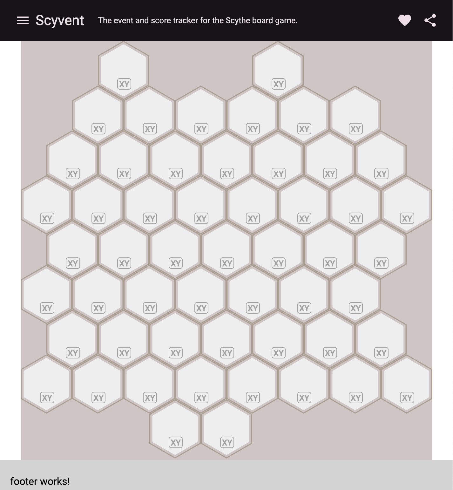

# scyvent
**scyvent** aims to be a full-featured event- and scoretracker for the Scythe boardgame.

At its core is a complete standardized deterministic action and event tracking notation for Scythe.
scyvent includes an interpreter, [REPL](https://en.wikipedia.org/wiki/Read%E2%80%93eval%E2%80%93print_loop) 
and runner and is suitable for tracking, recording, live-scoring and scripting games, matches and
complete tournaments or building and running AI opponents for Scythe.
... Errrm, ... [Wutt?*](#Wutt?)

scyvent aims to support all official rules, extensions, boards, SOPs and modes of Scythe including their
common variations and offer easy extendability to support fan-made modes and extensions.

scyvent aims to use the official Scythe terminology of the English and German board-game implementations of 
Scythe and avoid broken wording or translations of digital implementations of Scythe.

> [!IMPORTANT]
> Please note: **scyvent** is at its core a notation standard **_for_** Scythe, **_not_** a complete game nor an
implementation of the Scythe game itself! A copy of the Scythe board-game or one of its digital implementations
is required to play Scythe and make full use of scyvent.

### *Wutt?
If you're not familiar with software development or computer terminology and all this up to this point
sounds like gibberish to you, think of **scyvent** as a language to describe Scythe games that is readable
to humans while at the same time being clear and unambiguous enough for computers to understand. 🤓

#### Early Development Screenshot


## Development

**scyvent** is built with [TypeScript](https://www.typescriptlang.org) and [Angular](https://www.angular.dev) and
is [Free Open Source Software](https://en.wikipedia.org/wiki/Free_and_open-source_software) released under
the [MIT license](https://en.wikipedia.org/wiki/MIT_License).

Initial setup was built using [Angular CLI](https://github.com/angular/angular-cli) version 19.2.0.

## Development server

To start a local development server, run:

```bash
ng serve
```

Once the server is running, open your browser and navigate to `http://localhost:4200/`. The application will automatically reload whenever you modify any of the source files.

## Code scaffolding

Angular CLI includes powerful code scaffolding tools. To generate a new component, run:

```bash
ng generate component component-name
```

For a complete list of available schematics (such as `components`, `directives`, or `pipes`), run:

```bash
ng generate --help
```

## Building

To build the project run:

```bash
ng build
```

This will compile your project and store the build artifacts in the `dist/` directory. By default, the production build optimizes your application for performance and speed.

## Running unit tests

To execute unit tests with the [Karma](https://karma-runner.github.io) test runner, use the following command:

```bash
ng test
```

## Running end-to-end tests

For end-to-end (e2e) testing, run:

```bash
ng e2e
```

Angular CLI does not come with an end-to-end testing framework by default. You can choose one that suits your needs.

## Additional Resources

For more information on using the Angular CLI, including detailed command references, visit the [Angular CLI Overview and Command Reference](https://angular.dev/tools/cli) page.
